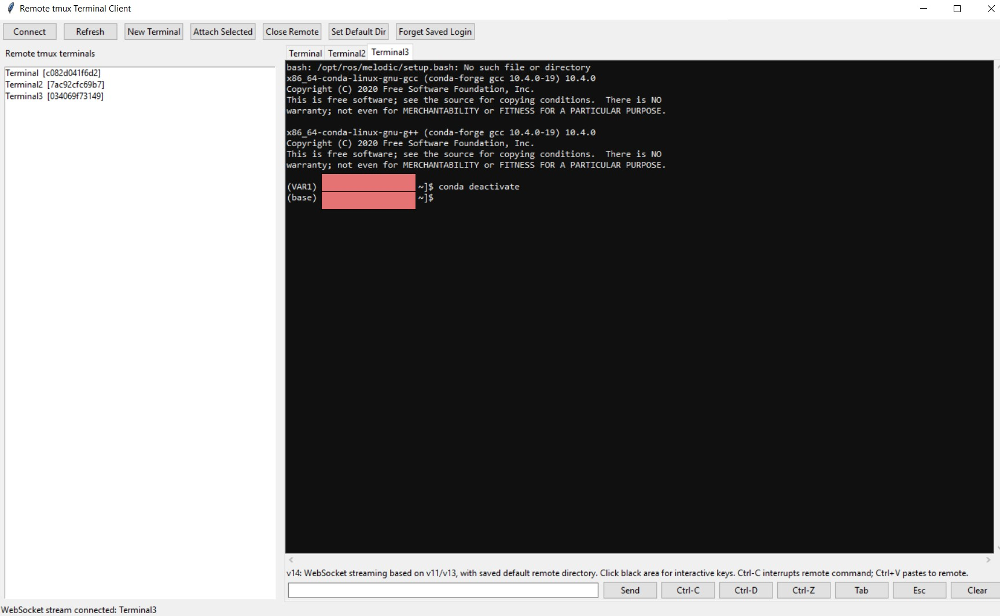

# Remote tmux Terminal GUI for Windows



## What it does

- Windows GUI connects to a Linux server through Windows `ssh.exe` local port forwarding.
- Linux server owns persistent terminals through `tmux`.
- Closing the Windows app only detaches; remote commands keep running.
- Reopening the Windows app can reattach to existing remote terminals.
- `Close Remote` is the only action that kills the remote tmux terminal.
- WebSocket streaming is used for terminal output, with instant snapshot resync after input.
- Login info can be saved on Windows, including host, port, username, key path, password via DPAPI, and default terminal directory.
- All commands can be entered in the input box at the bottom, or typed directly in the black area.
- New in v14: Windows can set a default remote directory. When a new terminal is created, Linux starts the normal login-like shell first, then automatically sends one `cd -- <path>` command to the tmux pane.

## Linux server

Install dependencies:

```bash
sudo apt install tmux python3-venv python3-pip
```

Start the server:

```bash
cd ~/remote_tmux_terminal_v14_default_dir/server
bash start_server.sh
```

For long-running use, start it inside tmux:

```bash
tmux new -s rterm_server
cd ~/remote_tmux_terminal_v14_default_dir/server
bash start_server.sh
# Ctrl-b, then d
```

Health check on Linux:

```bash
curl http://127.0.0.1:8765/health
```

## Windows client

Run:

```bat
windows_client\run_client.bat
```
or just run:
```
windows_client\dist\RemoteTmuxTerminal.exe
```
which will need to show a ssh.exe window.

Windows side does not need pip or third-party Python packages.

## Default directory behavior

You can set the default directory in two places:

1. In the connection dialog: `Default terminal directory (optional)`.
2. After the GUI opens: click `Set Default Dir`.

Example:

```text
/new_data/lzy/my_project
```

When you create a new terminal, the server does this conceptually:

```bash
# normal SSH-like shell startup first
# then automatically:
cd -- /new_data/lzy/my_project
```

Leaving the field empty means new terminals use the normal login directory.

Existing tmux terminals are not moved automatically. The setting only affects newly created terminals.
