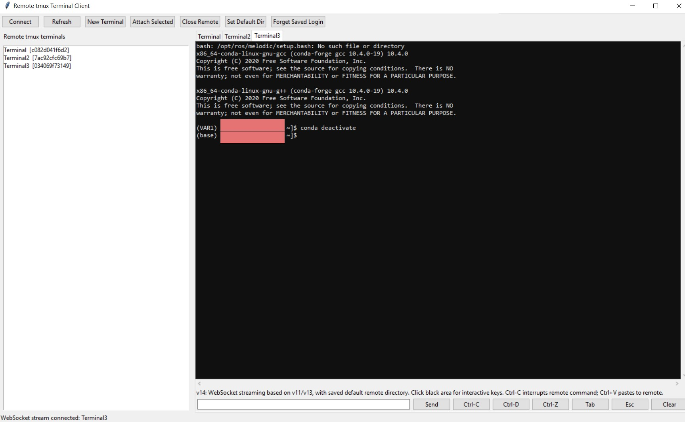

# Remote tmux Terminal GUI for Windows v31

**English** | [简体中文](README.zh-CN.md)



Remote tmux Terminal GUI is a lightweight Windows interface for persistent Linux terminals. The Windows client connects through an OpenSSH local port forward, while tmux on the Linux server owns the terminal sessions and running processes.

Closing the Windows client only detaches the display. Training jobs, servers, and other remote commands continue running, and the client can reconnect to the existing terminals later.

## Features

- Secure local port forwarding through the Windows built-in `ssh.exe`;
- persistent Linux terminals managed by tmux;
- real-time terminal output over WebSocket;
- automatic reattachment to existing terminals after reconnecting;
- multiple terminal tabs and batch remote-session closing;
- direct typing in the terminal view and a separate command input box;
- Enter, Backspace, Tab, arrow keys, Home, End, Delete, and Esc;
- common control keys including Ctrl-C, Ctrl-D, Ctrl-Z, Ctrl-L, and Ctrl-V;
- Windows clipboard copy and paste;
- configurable initial Linux directory for new terminals;
- adjustable terminal font size with automatic persistence;
- saved SSH host, port, username, key path, and connection settings;
- optional Windows DPAPI-encrypted password storage;
- optional hidden `ssh.exe` console window;
- packaging as a standalone Windows executable.

## v31 cursor improvements

v31 treats the tmux screen as authoritative instead of relying entirely on Windows-side cursor prediction:

- tmux physical rows are preserved instead of being joined with `capture-pane -J`;
- snapshots carry the cursor's snapshot row, terminal display column, and Tk character index;
- width conversion supports Chinese and other wide characters, combining characters, and Emoji ZWJ grapheme clusters;
- local prediction is used only to hide network round-trip latency;
- every server snapshot corrects the cursor to the remote authoritative position;
- tmux rows and columns are synchronized when the Windows terminal area or font size changes.

These changes significantly reduce cursor drift in regular shells, Chinese commands, wrapped command lines, history recall, and arrow-key editing.

## Architecture

```text
Windows GUI
    |
    | Windows ssh.exe local port forwarding
    v
Linux FastAPI / WebSocket service
    |
    | tmux new-session / send-keys / capture-pane
    v
Persistent tmux terminals and remote processes
```

```text
Close the Windows client  -> detach only; remote processes continue
Reopen the client         -> reconnect to existing tmux terminals
Click Close Remote        -> terminate the selected remote tmux sessions
```

## Project layout

```text
Remote-tmux-Terminal-GUI-for-Windows/
├── server/
│   ├── server.py           # v31 server entry point
│   ├── base_server.py      # complete server behavior
│   ├── protocol.py         # Unicode width and cursor protocol
│   ├── requirements.txt
│   └── start_server.sh     # one-command environment setup and launch
├── windows_client/
│   ├── client.py           # v31 Windows entry point
│   ├── base_client.py      # complete GUI, SSH, and terminal behavior
│   ├── run_client.bat
│   ├── build_windows_exe.bat
│   └── RemoteTmuxTerminal-v31.spec
├── tests/
│   └── test_protocol.py
├── UI.jpg
├── README.md
└── README.zh-CN.md
```

## Linux server

### System requirements

On Debian or Ubuntu:

```bash
sudo apt update
sudo apt install tmux python3 python3-venv
```

### One-command startup

From the repository root, run:

```bash
bash server/start_server.sh
```

On its first run, the script creates an isolated environment at `server/.venv`, installs FastAPI, Uvicorn, Pydantic, and `wcwidth`, and then starts the server. Later launches reuse the environment and reinstall dependencies only when the requirements file changes. This does not modify the system Python, a Conda environment, or your training environment.

The default listener is `127.0.0.1:8765`. Keep it bound to localhost and access it through the SSH tunnel rather than exposing it directly to the internet.

To use a different port:

```bash
bash server/start_server.sh --port 8766
```

Health check:

```bash
curl http://127.0.0.1:8765/health
```

### Long-running server

Run the service in a dedicated tmux session:

```bash
tmux new -s rterm_server
cd /path/to/this/project
bash server/start_server.sh
```

Press `Ctrl+B`, release it, and then press `D` to detach without stopping the service. Reattach later with:

```bash
tmux attach -t rterm_server
```

Training sessions named like `rterm_xxxxxxxxxxxx` are independent of the server session. Restarting the FastAPI service does not stop those training processes.

## Windows client

### Run from source

Windows needs Python and the Windows OpenSSH Client:

```bat
ssh -V
windows_client\run_client.bat
```

The client source uses only the Python standard library. Paramiko, Cryptography, and other third-party client packages are not required.

### Build a standalone EXE

The build machine needs Python and PyInstaller:

```bat
python -m pip install pyinstaller
windows_client\build_windows_exe.bat
```

Output:

```text
windows_client\dist\RemoteTmuxTerminal-v31.exe
```

The target Windows machine does not need Python, but it still needs the Windows OpenSSH Client.

## Connection settings

```text
SSH Host                 Linux host name or address
SSH Port                 SSH port, normally 22
Username                 Linux user name
Private key path         SSH private-key path
Password                 Optional; may be encrypted with DPAPI
Remote service port      Server port, default 8765
Default terminal dir     Initial directory for new terminals
Hide ssh.exe window      Hide the SSH console window
Font size                Terminal font size
```

Configuration is stored at:

```text
%APPDATA%\RemoteTmuxTerminal\client_config.json
```

Saved passwords are protected by Windows DPAPI and bound to the current Windows user. SSH keys or ssh-agent are recommended. Do not hide the SSH window when an interactive password prompt is required; a saved password can instead be supplied through `SSH_ASKPASS`.

## Default remote directory

When a default directory is configured, a new terminal first starts its normal login-like shell and then receives:

```bash
cd -- /your/default/path
```

This allows shell initialization, environment variables, and Conda initialization to complete first. The setting affects only new terminals and does not move existing tmux sessions.

## Common controls

Type directly in the black terminal area, or enter a complete command in the bottom input box and click Send.

```text
Ctrl + Plus / Ctrl + Minus    Change terminal font size
Ctrl + C                      Copy a selection, otherwise send interrupt
Ctrl + V                      Paste the Windows clipboard
Ctrl + Alt + V                Send a raw Ctrl-V to the remote terminal
Ctrl + Click                  Select or unselect a remote terminal
Shift + Click                 Select a range of terminals
```

Example long-running workflow:

```bash
conda activate myenv
cd /data/my_project
python train.py
```

Closing the Windows client does not stop the command. Start the client again to reconnect and continue monitoring it.

## Tests

Run the cursor-protocol tests with:

```bash
python -m unittest discover -s tests -p "test_protocol.py" -v
```

Recommended manual cases include ASCII, Chinese text, Emoji, combining characters, left/right arrows, Home/End, command history, wrapped commands, empty prompts, font-size changes, and window resizing.

## Limitations and security

- This is a lightweight terminal intended for persistent jobs and regular shell usage, not a complete xterm implementation.
- Complex full-screen TUIs such as `vim`, `htop`, and `less` may still have styling or partial-redraw differences.
- v31 fixes the primary cursor-coordinate problems, but the client does not reproduce every ANSI style.
- Keep the server bound to `127.0.0.1` and access it through SSH forwarding.
- `Close Remote` really terminates the remote tmux session; verify that it contains no important job first.
- Closing the application window only detaches and does not terminate remote work.
